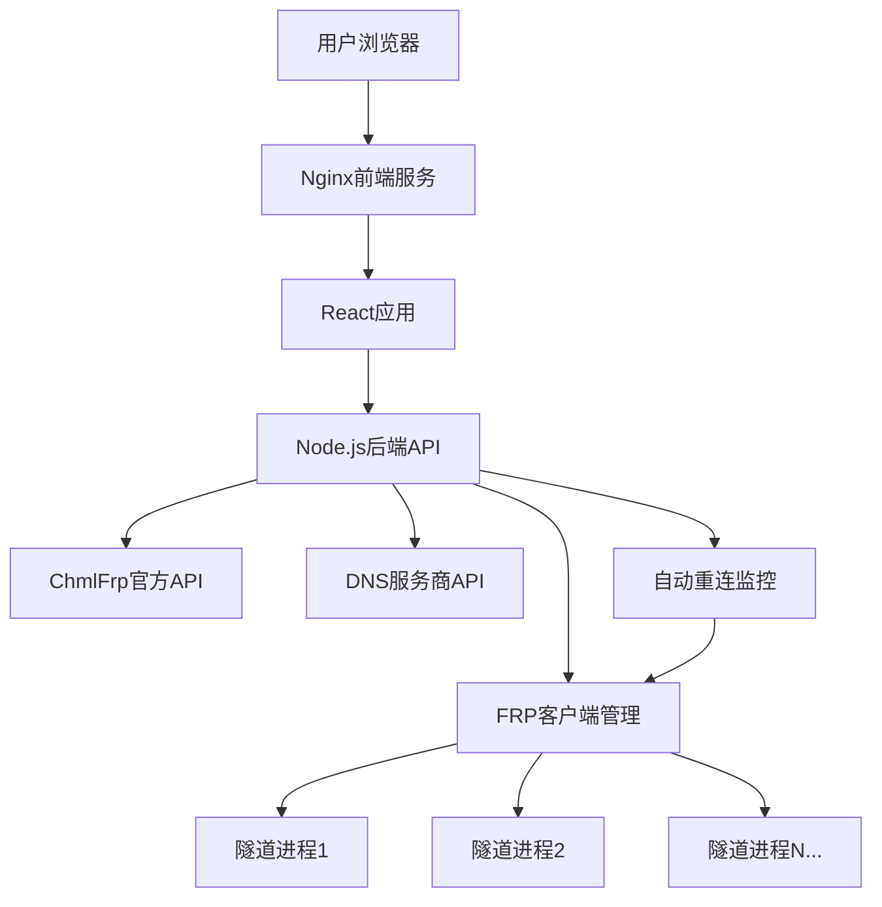

# 开发者文档

## 🏗️ 项目架构

### 整体架构



### 技术栈

#### 前端
- **React 18+** - UI框架
- **Ant Design 5+** - UI组件库
- **Axios** - HTTP客户端
- **React Router** - 路由管理

#### 后端
- **Node.js 18+** - 运行时环境
- **Express** - Web框架
- **Axios** - API代理
- **Child Process** - 进程管理

#### 容器化
- **Docker** - 容器化平台
- **Docker Compose** - 服务编排
- **Nginx** - 反向代理和静态文件服务

### 模块设计

#### 前端模块

```
frontend/src/
├── components/              # React组件
│   ├── Dashboard.js        # 主面板布局
│   ├── Login.js           # 登录组件
│   ├── TunnelManagement.js # 隧道管理
│   ├── DomainManagement.js # 域名管理
│   ├── UserProfile.js     # 用户资料
│   ├── Overview.js        # 概览页面
│   └── NodeStatus.js      # 节点状态
├── utils/                  # 工具函数
│   └── auth.js            # 认证管理
├── App.js                 # 主应用组件
└── index.js               # 应用入口
```

#### 后端模块

```
backend/
├── index.js               # 主服务器
├── frp-manager.js         # FRP客户端管理
├── frp-server.js          # FRP服务器管理
├── dns-providers.js       # DNS服务商集成
└── dns-providers-simple.js # 简化DNS集成
```

## 🔧 核心功能实现

### 1. FRP客户端管理

#### 隧道生命周期管理

```javascript
class FrpManager {
    constructor() {
        this.activeTunnels = new Map(); // 活跃隧道映射
        this.autoReconnectEnabled = true;
        this.startTunnelMonitoring(); // 启动监控
    }

    // 启动单个隧道
    async startSingleTunnel(tunnel, userToken) {
        // 1. 生成FRP配置文件
        const config = this.generateSingleTunnelConfig(tunnel, nodeToken);
        
        // 2. 启动FRP进程
        const process = spawn(this.frpBinaryPath, ['-c', configPath]);
        
        // 3. 监听进程输出
        process.stdout.on('data', this.handleProcessOutput);
        
        // 4. 注册到活跃隧道列表
        this.activeTunnels.set(tunnel.id, {
            process, tunnel, configPath, startTime: new Date()
        });
    }

    // 断线重连监控
    async checkAndReconnectTunnels() {
        for (const [tunnelId, info] of this.activeTunnels) {
            const isAlive = this.checkProcessHealth(info.process);
            if (!isAlive) {
                await this.attemptTunnelReconnect(tunnelId, info);
            }
        }
    }
}
```

#### 配置文件生成

```javascript
// YAML格式配置（推荐）
generateConfig(tunnels, userToken) {
    return `
serverAddr: "frp.linxi.link"
serverPort: 7000
token: "${userToken}"

# 心跳配置 - 断线重连
heartbeatInterval: 20
heartbeatTimeout: 60
loginFailExit: false
reconnectOnError: true
maxReconnectTimes: -1

# 隧道配置
proxies:
${tunnels.map(tunnel => this.generateTunnelProxy(tunnel)).join('')}
`;
}

// INI格式配置（兼容）
generateSingleTunnelConfig(tunnel, nodeToken) {
    return `
[common]
server_addr = ${serverAddr}
server_port = 7000
user = ${nodeToken}
token = ChmlFrpToken

# 心跳和重连配置
heartbeat_interval = 20
heartbeat_timeout = 60
login_fail_exit = false

[${tunnel.name}]
type = ${tunnel.type}
local_ip = ${tunnel.localip}
local_port = ${tunnel.nport}
${tunnel.type === 'http' || tunnel.type === 'https' ? 
  `custom_domains = ${tunnel.dorp}` : 
  `remote_port = ${tunnel.nport}`}
`;
}
```

### 2. 断线自动重连

#### 多层检测机制

```javascript
// 1. FRP原生重连（配置级别）
heartbeatInterval: 20          // 心跳间隔
heartbeatTimeout: 60           // 心跳超时
reconnectOnError: true         // 错误重连
maxReconnectTimes: -1          // 无限重连

// 2. 系统级进程监控
startTunnelMonitoring() {
    this.monitoringInterval = setInterval(() => {
        this.checkAndReconnectTunnels();
    }, 30000); // 30秒检查一次
}

// 3. 管理端口健康检查
async checkTunnelConnection(adminPort) {
    try {
        const response = await axios.get(`http://127.0.0.1:${adminPort}/api/status`);
        return response.status === 200;
    } catch {
        return false;
    }
}
```

#### 智能重连策略

```javascript
async attemptTunnelReconnect(tunnelId, tunnelInfo, reason) {
    // 重连限制检查
    if (tunnelInfo.reconnectAttempts >= this.maxReconnectAttempts) {
        console.log(`隧道重连次数超限，停止重连`);
        return;
    }

    // 递增延迟重连
    const delay = Math.min(1000 * Math.pow(2, tunnelInfo.reconnectAttempts), 30000);
    
    setTimeout(async () => {
        // 清理旧进程
        if (tunnelInfo.process) {
            tunnelInfo.process.kill('SIGTERM');
        }
        
        // 重新启动隧道
        const result = await this.startSingleTunnel(tunnelInfo.tunnel, tunnelInfo.userToken);
        
        if (result.success) {
            tunnelInfo.reconnectAttempts = 0; // 重置计数器
        } else {
            tunnelInfo.reconnectAttempts++;
        }
    }, delay);
}
```

### 3. DNS自动配置

#### DNS服务商抽象接口

```javascript
class DNSProvider {
    constructor(config) {
        this.config = config;
    }

    // 标准接口
    async getDomains() { throw new Error('Not implemented'); }
    async getRecords(domain) { throw new Error('Not implemented'); }
    async createRecord(domain, record) { throw new Error('Not implemented'); }
    async updateRecord(domain, record) { throw new Error('Not implemented'); }
    async deleteRecord(domain, recordId) { throw new Error('Not implemented'); }
}
```

#### 阿里云DNS实现

```javascript
class AliyunDNS extends DNSProvider {
    async createRecord(domain, record) {
        const params = {
            'Action': 'AddDomainRecord',
            'DomainName': domain,
            'RR': record.name,
            'Type': record.type,
            'Value': record.value,
            'TTL': record.ttl || 600
        };

        const signature = this.generateSignature(params);
        const response = await axios.get('https://alidns.aliyuncs.com/', {
            params: { ...params, 'Signature': signature }
        });

        return this.parseResponse(response.data);
    }

    generateSignature(params) {
        // 阿里云API签名算法
        const sortedParams = Object.keys(params).sort().map(key => 
            `${encodeURIComponent(key)}=${encodeURIComponent(params[key])}`
        ).join('&');
        
        const stringToSign = `GET&%2F&${encodeURIComponent(sortedParams)}`;
        return crypto.createHmac('sha1', this.config.accessKeySecret + '&')
                    .update(stringToSign).digest('base64');
    }
}
```

#### 自动域名配置流程

```javascript
async syncDomainConfiguration(tunnel, userToken) {
    if (!tunnel.dorp) return;

    // 1. 判断域名类型
    const isFreeSubdomain = this.isFreeSubdomain(tunnel.dorp);
    
    if (isFreeSubdomain) {
        // 免费二级域名 - 调用ChmlFrp API
        await this.syncFreeSubdomainConfiguration(tunnel, userToken);
    } else {
        // 自定义域名 - DNS API配置
        await this.syncCustomDomainConfiguration(tunnel);
    }
}

async syncCustomDomainConfiguration(tunnel) {
    const dnsConfig = this.getDNSConfig();
    if (!dnsConfig) return;

    const provider = new DNSProviders[dnsConfig.provider](dnsConfig);
    
    // 获取节点IP
    const nodeIP = await this.getNodeIP(tunnel.node);
    
    // 创建或更新CNAME记录
    await provider.createRecord(tunnel.dorp, {
        name: '@',
        type: 'A',
        value: nodeIP,
        ttl: 600
    });
}
```

### 4. Token安全管理

#### 多端失效检测

```javascript
// 前端：响应拦截器
axios.interceptors.response.use(
    (response) => {
        // 检查Token失效标识
        if (response.data?.code === 401 || 
            response.data?.msg?.includes('Token')) {
            handleTokenInvalid();
        }
        return response;
    },
    (error) => {
        if (error.response?.status === 401) {
            handleTokenInvalid();
        }
        return Promise.reject(error);
    }
);

// 定期Token验证
export const startTokenMonitoring = () => {
    setInterval(async () => {
        const isValid = await validateToken();
        if (!isValid) {
            handleTokenInvalid();
        }
    }, 5 * 60 * 1000); // 5分钟检查一次
};
```

#### Token重置集成

```javascript
// 后端：集成官方重置API
app.post('/api/reset_token', async (req, res) => {
    const currentToken = req.headers.authorization?.replace('Bearer ', '');
    
    // 调用官方重置API
    const resetResponse = await axios.get('https://cf-v2.uapis.cn/retoken', {
        params: { token: currentToken }
    });

    if (resetResponse.data.code === 200) {
        // Token重置成功，强制客户端重新登录
        res.json({
            code: 200,
            msg: 'Token重置成功，请重新登录',
            data: { need_relogin: true }
        });
    }
});
```

## 🛠️ 开发环境搭建

### 前置要求

```bash
# Node.js 18+
node --version
npm --version

# Docker
docker --version
docker-compose --version

# Git
git --version
```

### 本地开发

#### 1. 克隆项目

```bash
git clone https://github.com/your-username/chmlfrp-docker.git
cd chmlfrp-docker
```

#### 2. 后端开发

```bash
cd backend

# 安装依赖
npm install

# 开发模式启动（热重载）
npm run dev

# 或者正常启动
npm start
```

#### 3. 前端开发

```bash
cd frontend

# 安装依赖
npm install

# 开发模式启动
npm start

# 构建生产版本
npm run build
```

#### 4. 容器开发

```bash
# 完整容器构建和启动
docker-compose up -d --build

# 仅重建特定服务
docker-compose up -d --build backend
docker-compose up -d --build frontend

# 查看日志
docker-compose logs -f
```

### 开发工具配置

#### VS Code配置

```json
// .vscode/settings.json
{
    "editor.formatOnSave": true,
    "editor.codeActionsOnSave": {
        "source.fixAll.eslint": true
    },
    "javascript.preferences.importModuleSpecifier": "relative",
    "typescript.preferences.importModuleSpecifier": "relative"
}
```

#### ESLint配置

```json
// .eslintrc.js
module.exports = {
    env: {
        browser: true,
        es2021: true,
        node: true
    },
    extends: [
        'eslint:recommended',
        'plugin:react/recommended'
    ],
    rules: {
        'no-unused-vars': 'warn',
        'no-console': 'off',
        'react/prop-types': 'off'
    }
};
```

## 🧪 测试

### 单元测试

```bash
# 后端测试
cd backend
npm test

# 前端测试
cd frontend
npm test
```

### 集成测试

```bash
# API测试
curl -X GET "http://localhost:3001/api/health"

# 隧道功能测试
curl -X POST "http://localhost:3001/api/frp/start-tunnel" \
  -H "Content-Type: application/json" \
  -H "Authorization: Bearer your-token" \
  -d '{"tunnel": {...}}'
```

### Docker测试

```bash
# 构建测试
docker-compose build

# 健康检查
docker-compose ps
docker-compose logs backend | grep "启动成功"

# 功能测试
./verify-deployment.ps1
```

## 📦 构建和部署

### 生产构建

```bash
# 清理旧版本
docker-compose down
docker system prune -f

# 生产构建
docker-compose -f docker-compose.prod.yml up -d --build

# 验证部署
docker-compose ps
curl http://localhost:8888/api/health
```

### 多阶段构建优化

```dockerfile
# Dockerfile.frontend
FROM node:18-alpine AS build
WORKDIR /app
COPY package*.json ./
RUN npm ci --only=production
COPY . .
RUN npm run build

FROM nginx:alpine
COPY --from=build /app/build /usr/share/nginx/html
COPY nginx.conf /etc/nginx/nginx.conf
EXPOSE 80
CMD ["nginx", "-g", "daemon off;"]
```

### 性能优化

#### 前端优化

```javascript
// 代码分割
const TunnelManagement = lazy(() => import('./TunnelManagement'));
const DomainManagement = lazy(() => import('./DomainManagement'));

// 组件懒加载
<Suspense fallback={<Spin size="large" />}>
    <Route path="/tunnels" element={<TunnelManagement />} />
</Suspense>

// API缓存
const apiCache = new Map();
const cachedRequest = async (url, options = {}) => {
    const cacheKey = `${url}${JSON.stringify(options)}`;
    if (apiCache.has(cacheKey)) {
        return apiCache.get(cacheKey);
    }
    
    const response = await axios(url, options);
    apiCache.set(cacheKey, response);
    setTimeout(() => apiCache.delete(cacheKey), 30000); // 30秒缓存
    return response;
};
```

#### 后端优化

```javascript
// 请求并发控制
const concurrencyLimit = 10;
const semaphore = new Semaphore(concurrencyLimit);

async function handleRequest(req, res, next) {
    await semaphore.acquire();
    try {
        await next();
    } finally {
        semaphore.release();
    }
}

// 资源池管理
class ProcessPool {
    constructor(maxSize = 50) {
        this.maxSize = maxSize;
        this.activeProcesses = new Map();
    }

    async createProcess(config) {
        if (this.activeProcesses.size >= this.maxSize) {
            throw new Error('进程池已满');
        }
        // 创建进程逻辑
    }
}
```

## 🔍 调试和故障排除

### 日志系统

```javascript
// 结构化日志
const logger = {
    info: (message, meta = {}) => {
        console.log(JSON.stringify({
            level: 'info',
            message,
            timestamp: new Date().toISOString(),
            ...meta
        }));
    },
    error: (message, error = {}) => {
        console.error(JSON.stringify({
            level: 'error',
            message,
            error: error.message || error,
            stack: error.stack,
            timestamp: new Date().toISOString()
        }));
    }
};
```

### 性能监控

```javascript
// API响应时间监控
app.use((req, res, next) => {
    const start = Date.now();
    res.on('finish', () => {
        const duration = Date.now() - start;
        logger.info('API请求', {
            method: req.method,
            url: req.url,
            status: res.statusCode,
            duration: `${duration}ms`
        });
    });
    next();
});

// 内存使用监控
setInterval(() => {
    const memUsage = process.memoryUsage();
    logger.info('内存使用', {
        rss: `${Math.round(memUsage.rss / 1024 / 1024)}MB`,
        heapUsed: `${Math.round(memUsage.heapUsed / 1024 / 1024)}MB`,
        heapTotal: `${Math.round(memUsage.heapTotal / 1024 / 1024)}MB`
    });
}, 60000); // 每分钟记录一次
```

### 常见问题解决

#### 1. 端口冲突

```bash
# 查看端口占用
netstat -tulpn | grep :8888
lsof -i :3001

# 修改端口配置
echo "FRONTEND_PORT=8080" > .env
echo "BACKEND_PORT=3002" >> .env
```

#### 2. Docker构建失败

```bash
# 清理Docker缓存
docker builder prune -f
docker system prune -a

# 查看构建日志
docker-compose build --no-cache --progress=plain

# 单独测试镜像
docker build -f Dockerfile.backend -t test-backend .
docker run --rm test-backend node --version
```

#### 3. API代理失败

```javascript
// 增加重试和错误处理
const axiosRetry = require('axios-retry');
axiosRetry(axios, {
    retries: 3,
    retryDelay: axiosRetry.exponentialDelay,
    retryCondition: (error) => {
        return axiosRetry.isNetworkOrIdempotentRequestError(error) ||
               error.code === 'ECONNRESET';
    }
});
```

## 📚 API参考

### 隧道管理API

| 方法 | 端点 | 说明 |
|------|------|------|
| GET | `/api/tunnel` | 获取隧道列表 |
| POST | `/api/create_tunnel` | 创建隧道 |
| POST | `/api/update_tunnel` | 更新隧道 |
| POST | `/api/delete_tunnel` | 删除隧道 |
| GET | `/api/tunnel_config` | 获取隧道配置 |

### FRP管理API

| 方法 | 端点 | 说明 |
|------|------|------|
| GET | `/api/frp/status` | 获取FRP状态 |
| POST | `/api/frp/start-tunnel` | 启动单个隧道 |
| POST | `/api/frp/stop-tunnel` | 停止单个隧道 |
| GET | `/api/frp/logs` | 获取FRP日志 |
| POST | `/api/frp/auto-reconnect` | 设置自动重连 |

### DNS管理API

| 方法 | 端点 | 说明 |
|------|------|------|
| POST | `/api/dns/domains` | 获取域名列表 |
| POST | `/api/dns/records` | 获取DNS记录 |
| POST | `/api/dns/records/create` | 创建DNS记录 |

## 🎯 路线图

### 已完成功能 ✅

- [x] 基础隧道管理
- [x] 断线自动重连
- [x] DNS自动配置
- [x] Token安全管理
- [x] 实时状态监控
- [x] Docker容器化部署

### 计划中功能 🔄

- [ ] 隧道分组管理
- [ ] 流量统计图表
- [ ] 移动端适配
- [ ] 多语言支持
- [ ] 插件系统
- [ ] API速率限制

### 未来规划 🔮

- [ ] Kubernetes部署支持
- [ ] 集群化管理
- [ ] 监控告警系统
- [ ] 白标定制
- [ ] 企业级功能

---

## 📞 技术支持

如果在开发过程中遇到问题，可以通过以下方式获取帮助：

1. **查看文档** - 详细阅读本开发文档
2. **GitHub Issues** - 提交技术问题和bug报告
3. **Discussions** - 参与技术讨论和经验分享
4. **代码审查** - 提交PR前的代码review

## 🤝 贡献代码

欢迎各种形式的贡献：

- 🐛 报告和修复bug
- ✨ 新功能开发
- 📝 文档改进
- 🎨 UI/UX优化
- 🔧 性能优化
- 🧪 测试用例

让我们一起打造更好的ChmlFrp管理面板！
